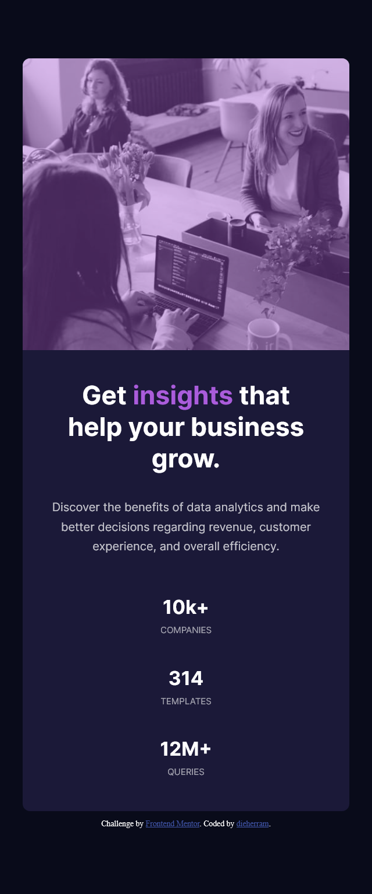

# Desafío Stats Preview Card Component 📊 de Frontend Mentor 😎

## Overview 🚀
¡Hola! El desafío consiste en armar un componente de tarjeta y hacer que se vea lo más parecido posible al diseño original, tanto en móviles como escritorio.

## Screenshot 📸
Aquí están mis resultado:
### Escritorio

### Móvil

### Links

- Solution URL: (https://dieherram.github.io/fem-stats-preview-card-component/)

## My Process 💻
Mi estrategia fue simple pero efectiva. Primero, organicé el HTML y luego apliqué magia de CSS, especialmente Flexbox, para darle ese toque al diseño.

## Built With 🛠️
- HTML5
- CSS
- Flexbox

## What I Learned 🤓
Este proyecto fue una montaña rusa de aprendizaje. Reforcé mis habilidades con HTML y CSS.

## Continued Development 🚧
Para seguir creciendo, ahora me voy a sumergir en el mundo de CSS Grid. Quiero ser un maestro de las cuadrículas y llevar mis diseños al siguiente nivel. ¡Expectante por lo que viene!

## Author

- Github - (https://github.com/dieherram)
- Frontend Mentor - [@dieherram](https://www.frontendmentor.io/profile/dieherram)
- Codewars - [@dieherram](https://www.codewars.com/users/dieherram)
- LinkedIn - (https://www.linkedin.com/in/diego-hernandez-ramos/)

## Acknowledgments 🙌
Gracias a Frontend Mentor por estos desafíos que nos hacen mejorar cada día. También a la comunidad de devs, ¡gracias! 🌟
